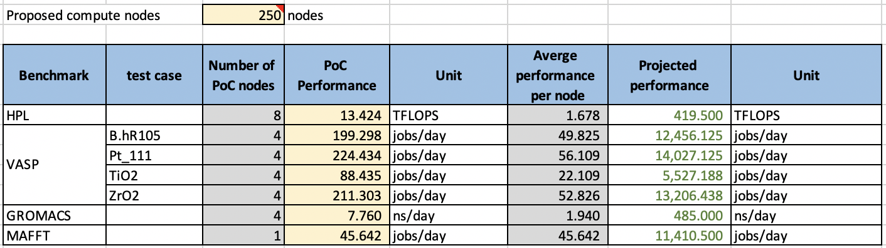

# Compute Node Benchmark

The compute node benchmark consists of 4 applications as follows

| Benchmark     | PoC Nodes| Number of  testcases |
| ------------- |---------:| ---------:|
| HPL           | 8        | 1         | 
| GROMACS       | 4        | 1         | 
| VASP          | 4        | 4         | 
| MAFFT         | 1        | 1         | 

* High-Performance Linpack (HPL)
* GROMACS
* VASP
* MAFFT

For detail instruction, see README.md file in each benchmark folder.

## Example Performance Results 

